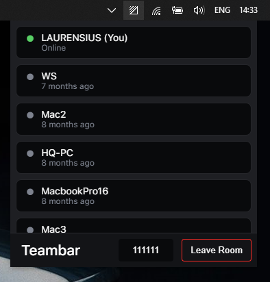

# Teambar



See your teams' online status in a room with 6 digits.
Build with VueJS, Electron, Menubar, and Firebase.
Developed just for fun trying the tech stack.

#### Build Setup

``` bash
# install dependencies
npm install

# serve with hot reload at localhost:9080
npm run dev

# build electron application for production
npm run build

# lint all JS/Vue component files in `src/`
npm run lint

```

---

This project was generated with [electron-vue](https://github.com/SimulatedGREG/electron-vue)@[45a3e22](https://github.com/SimulatedGREG/electron-vue/tree/45a3e224e7bb8fc71909021ccfdcfec0f461f634) using [vue-cli](https://github.com/vuejs/vue-cli). Documentation about the original structure can be found [here](https://simulatedgreg.gitbooks.io/electron-vue/content/index.html).

### Todo

- [x] Connect to firebase
- [x] Join existing or create
- [x] Create new room with random 6 digit
- [x] On connect Show os.hostname on room with status online
- [x] On disconnect change status offline
- [x] Option to leave room
- [x] Change taskbar icon of user online in the room
- [x] Handle if app started offline
- [ ] Add password to room
